# Hub View 3D — handoff

> For whoever picks up the Hub View next, human or Claude Code. Written
> 2026-10-09 at the end of the first build (PR #42, branch
> `feature/hub-view-3d`, head `b5624e1`, every check green). Target: Airline
> Empire **1.1**, not the 1.0 launch.
>
> The owner's brief is: **the hub must look identical to the reference
> clip** — the same isometric clay world, the same light glass dashboard, the
> same five shots. This file is the shortest path from what exists to that.

> **Update, 2026-10-09 (second session, branch `claude/kind-bardeen-ajulsw`
> on top of `feature/hub-view-3d`):** work-plan steps 1–3 are done and step
> 5 (bloom) is in code, waiting for a device. See §0 for what changed,
> gap by gap; the rendering research and the audit of the first build are
> in [`HUB_RENDERING_RESEARCH.md`](HUB_RENDERING_RESEARCH.md).

Read in this order:

1. This file — state, gaps, the work plan, how to check yourself.
2. [`HUB_VIEW_3D.md`](HUB_VIEW_3D.md) — the visual bible: what the reference
   shows, palette, camera, lighting, data mapping, platform.
3. [`HUB_MODEL_LIST.md`](HUB_MODEL_LIST.md) — every 3D model the reference
   contains, with sizes, materials, slot names and priorities.
4. [`HUB_MODEL_PIPELINE.md`](HUB_MODEL_PIPELINE.md) — how those models get
   made: Meshy + Blender MCP + the repo's cleanup and check scripts.

---

## 0. Second session — what changed (2026-10-09)

Captures: `docs/design/hub-view/` now holds the second session's iPad
renders (`hub-0*.jpg`). Checks on Linux: the full Core suite (651 tests)
and the warnings-as-errors release build are green; the app compiles and
captures on the `Hub view review` workflow (iPad Pro 13", iPhone 17 Pro Max).

| Gap | Status | How |
|---|---|---|
| A1 framing | **Done** | `HubFraming.swift` (Core): every shot names a *subject*; the solver places target + distance so it fills the screen area the dashboard leaves free (`HubSafeArea.wide` / `.tall`). Overview subject: terminal, piers, parked envelopes, kerb. Tested for every airport, iPad and iPhone (`shotsFrameTheirSubjectInTheSafeArea`). |
| A2 apron | **Done** | Apron = parked envelopes + piers + pushbacks + one taxilane; stands spread over every pier face, inner faces first. |
| A3 glass | **Done** | Glazed barrel vaults with white ribs on the piers and three on the terminal roof (`.skylight` glass). |
| A4 vehicles | **Done** | `serviceLanes` in Core; tugs, baggage trains, vans, bowsers, buses shuttle on them; kerb buses and taxis; every occupied stand dressed. |
| A5 queue in every shot | **Done** | Focus overlays are shot-independent; captures hold the focus stand at boarding (`-AEUITestHubStage boarding`, `HubSnapshot.holding`). |
| B1 gate camera | **Done** | Behind the tail on the side away from the terminal, subject = the jet's own extremities + bridge. Nose points at the concourse (left on screen at ARN gate 1, not right as in the reference — a camera on the reference's side would look across the terminal roof at the stands nearest the building). |
| B2 queue | **Done** | 20 walkers on the focused queue while boarding. |
| B3 pulse rings | **Partial** | Four tilted rings at the camera-side engine. Additive blending (iOS 18 `Program.Descriptor.blendMode = .add`) not yet used. |
| B4 glass bridge | **Done** | Glass tube with white rib rings, white floor, rotunda, cab at door height. |
| B5 callout | **Done** | Clamped between the KPI row and the timeline, clear of the inspector. |
| B6 / B7 models | Open | Procedural jets now have cabin windows and a four-pane windscreen; authored models still the real fix (step 4). |
| C1 doll's house | **Done** | Each 70–90 m bay is a room: end wall, mezzanine + back wall, glazed partition to the next bay, roof frame that stays when the roof lifts; camera solved onto the first bay. |
| C2 FIDS | **Done** | Two boards per bay at the mezzanine's front edge. |
| C3 shops | **Partial** | Shelves carry rows of small product boxes; fascia signs unchanged. |
| C4 kiosks | **Done** | 4–7 per row, lit blue screens (`.kioskScreen`). |
| C5 heatmap | **Done** | One 4–9 m pool per hotspot (five per bay), red→orange→yellow→clear, in metres on both axes. |
| C6 people | **Partial** | Crowd batched into one mesh per material (so it can grow); every third traveller has a suitcase. Figures are still capsules. |
| C7 pins | **Done** | Blue teardrop with a white eye. |
| D1 district | **Done** | Four 4–6 floor apartment blocks on the district's airport side behind the villas, a crescent road; a departure turns out over the district. |
| D2 route | **Done** | Raised rounded cyan ribbon with a halo, on the streets past each stop's gate. |
| D3 curved roads | **Partial** | Roundabouts at the two terminal junctions; other corners still square. |
| D4 cart | **Done** | Cart + tank trailer loop the streets by the first stop. |
| D5 villa | **Done** (procedural) | Two storeys, flat roofs with a navy fascia, dark-framed glazing, wood cladding, terrace, hedges. |
| E1 night palette | **Re-tuned** | Blue-grey albedos under a near-neutral lavender key and greyer sky. |
| E2 windows | **Done** | Lit windows only (office emission map), window light spilling onto terraces, kerb and apron. |
| E3 bloom | **In code, device-only** | `HubPostProcess.swift`; the Simulator cannot write the sRGB target, so captures never show it. |
| E4 trees / lamps | **Done** | Teal trees; lamp heads emissive with warm pools. |
| F2 timeline | **Done** | 58 % of the width on iPad. |
| F1 inspector render | Open | |

Also fixed: depth range and shadow range now follow the camera; shot
changes turn the short way; scene build no longer copies every mesh batch
on each append (it was quadratic). Details in
[`HUB_RENDERING_RESEARCH.md`](HUB_RENDERING_RESEARCH.md) §6.

**Verdict after the second session:** composition, density, glass,
palette and night now read as the reference's product in all five shots
(night roads sample at (70, 74, 126) against the reference's `#4A4C78`).
What still separates them is micro-detail — procedural jets, capsule
people, plain vehicles — which is step 4's authored models, and the soft
glow and occlusion of a pre-rendered frame, which is step 5 on a device.

**Next:** judge bloom on a device; authored models (step 4); SSAO once
depth is confirmed in `.nonAR`; additive glows; device performance pass
(step 6).

## 0b. Third session — motion, stats, dashboard, landscape (2026-10-09)

The owner asked for more detail, for every control to work, for every stat
to be visible, for motion that feels professional, and allowed landscape
where it serves the game. What changed:

| Area | Where | What |
|---|---|---|
| Camera motion | `HubScene.swift` (`HubSpring`, `HubRigSpring`) | Critically damped springs instead of a fixed lerp: starts from rest, never overshoots, keeps velocity when retargeted. Zoom runs in log space; the target leads on the way in, the zoom leads on the way out. Shot changes take 0.42–0.68 s smooth time by travel. Pans and twists coast after release (capped fling); the idle orbit eases in over ~4 s. |
| Day ↔ night | `HubPalette.mix`, `HubMaterials.make` (`dusk`) | A 1.5 s eased crossfade, repainted in 12 steps; every glow scales with a continuous `dusk` value; the sky probe regenerates once, at the midpoint. |
| Traffic motion | `HubMover`, `HubPath.rounded/offset/roundTrip` (Core) | Paths rounded through Bézier corners; acceleration and braking limits; look-ahead steering; jets bank into turns and pitch on climb-out; two-way loops with U-turns so nothing reverses; fades where open paths restart. Parked jets glide during pushback. |
| Route fan | `HubDynamics.updateRouteFan` | The player's routes leave the terminal roof as arcs on their real great-circle bearings (north up the screen), coloured by load factor (cyan new, green ≥ 75 %, amber 55–75 %, rose < 55 %), with a light per daily round trip running out and back. Labels on the eight busiest; a highlighted route draws bright and thick. Overview only. |
| Stand tags | `HubDynamics.rebuildAnchors`, `HubStandTagView` | Gate, flight and stage over each of the player's jets in the overview, tinted by state; tap to focus and cut to the gate. |
| Layers | `HubOverlay`, layers dropdown | Route fan, stand tags, traffic, place labels — each switchable. |
| Insights | `HubInsights.swift` (Core), `HubPanels.swift` | Side panel with four tabs: Overview (KPI tiles, terminal and slot gauges, movements by hour chart, alerts), Routes (load, trips, profit and trend; tap to light the route), Slots (stacked share by carrier), Airline (cash, hub money, reputation bars, facilities, fleet). Every KPI card opens it. |
| Search | `HubSearch.swift` (Core) | Gates, flights, aircraft, routes and places, ranked; results take the camera there. ⌘K focuses it on iPad. |
| Alerts | `HubInsights.alerts` | Delays, maintenance, slot and terminal pressure, thin routes; the bell shows the count; an alert about a stand focuses it. |
| Hub switcher | `HubInsights.network`, `HubScreen.switchTo` | Every airport in the network, home first; swaps the airport in place with a crossfade. |
| Inspector | `HubInspector` | Pages for Flight, Aircraft, Route and Turnaround, swiped or picked from tabs that widen to name the active page. |
| Board | `HubBoard` | Rows slide in and out, open their stand or their route; counts as badges. |
| Airfield | `HubSceneBuilder.airfieldLights` etc. | Runway edge, threshold and approach lights; blue taxiway edge lights; apron floodlight masts with light pools; windsocks; a perimeter fence; painted stand numbers. All glow after dusk. |
| Landscape iPhone | `AEOrientation.swift`, `HubChromeMode`, `HubSafeArea.landscape` | The hub opens in landscape on iPhone and turns back on close (iPad keeps every orientation). Its own compact layout: shots in the top bar, KPI chips, controls down the right, a slim timeline, the board behind a Flights button. The framing solver has a landscape safe area. |
| UI motion | `HubMotion`, `HubPressStyle` | One set of springs for every panel; buttons sink on press; the shot picker's pill slides between shots; numbers roll; the timeline's fill and tug glide; anchored labels scale in and out. |

Captures now include the insights panel (`HUB-07`, `HUB-08`), and the
iPhone captures are landscape. Verified on `Hub view review` run
37945570337 (`9d04f4b`): both devices green, every shot captured. The
first run's iPhone failure was the UI-test auto-open giving up after 20 s
on a cold first launch; it now waits a minute. Core: the full suite (655
tests) and the warnings-as-errors release build are green; the 29 hub
tests include the new search, network and landscape-framing tests.

| Insights (iPad, night) | iPhone, landscape |
|---|---|
| 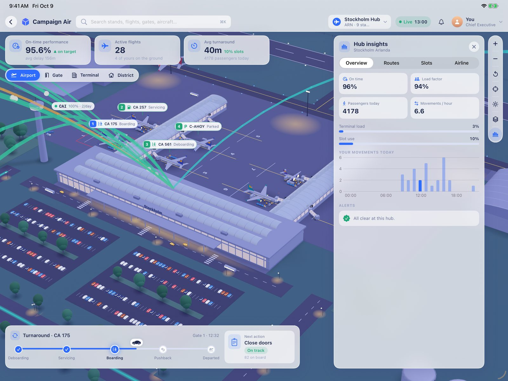 | 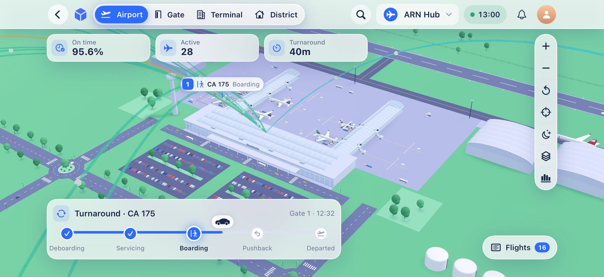 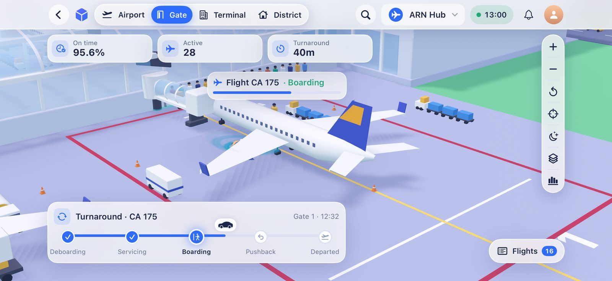 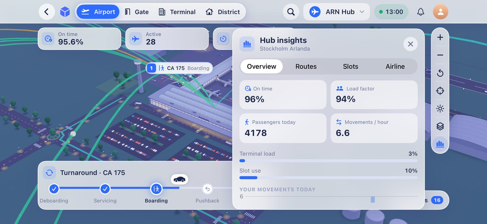 |

**Next:** everything in §0's "Next" still stands (device bloom, authored
models, SSAO, additive glows, performance on a device). New from this
session: profile the route fan and stand tags on a device with a large
network (the fan rebuilds only when a route's band or frequency changes,
labels are capped at eight); consider a second camera preset that frames
the whole fan; and the narrow iPad split-view top bar can still crowd
below ~360 pt.

## 0c. Upgrading from inside the hub (step 1 of the upgrade plan)

The two airport services the game already sells — the passenger lounge and
ground services, levels 0–2 — are now bought, seen and celebrated in the
Hub View. No new economy: prices, effects and the refusal rules are the
existing ones, and buying sends the same `ConfigureAirportFacilitiesCommand`
the Airport Services screen sends.

| Piece | Where | What |
|---|---|---|
| Sites | `HubLayout.facilitySites` (Core) | The lounge on the east end of the terminal roof (the roof's skylight vaults stop short of it); the depot on a lot beside the apron, the first of four candidates clear of every piece, stand and lane (lawns and trees on it are cleared). Tested for every airport. |
| Offers | `HubUpgrades.swift` (Core), `HubSnapshot.upgrades` | Per facility: level, building name, current effect and monthly cost, the next level's effect, build cost and monthly cost, and — from the command's own `validate` — why it is blocked (no presence, airport closed, not enough cash). |
| Camera | `HubCameraShot.facility` | Frames the site with room for the finished building; the route fan steps aside while a site is in focus. |
| Buildings | `HubFacilities.swift` | Lounge: 0 a marked-out site among planters; 1 a glass pavilion with an airline fascia, seating and a railed deck; 2 a two-tier flagship with a timber terrace, parasols and a string of lights that glows after dusk. Depot: 0 the shared handler's cabin and two grey vehicles; 1 your shed in your colours with six liveried vehicles in painted bays; 2 a bigger shed with solar panels, chargers, a wash bay and ten vehicles. |
| Construction | `HubFacilityYard.update` | 4.4 s: scaffold and crane rise, the jib slews, the old building fades, the new one grows with a little overshoot, the rig comes down, a pulse spreads on the ground. Plays whenever a level goes up, from the hub or from the Airport Services screen. |
| Interaction | `HubUpgradeCard`, `HubFacilityTagView`, `HubToastView` | Tap the building, its floating tag, or its row in Insights › Airline: the camera flies to the site and the card opens (level steps, now / next, build and monthly cost, a two-tap Build · Confirm). A toast announces the opening. "Upgrade sites" is a layer. |

Captures: `HUB-09-upgrade` (card at the lounge site), `HUB-10-construction`
and `HUB-11-built`; the UI test taps the site's tag in the world, as a
player would, and orders the next level. Verified green on both devices
(runs 37992305861 and 37994141895, iPhone; iPad on 37992305861).

| Upgrade card at the site | Construction | Built |
|---|---|---|
| 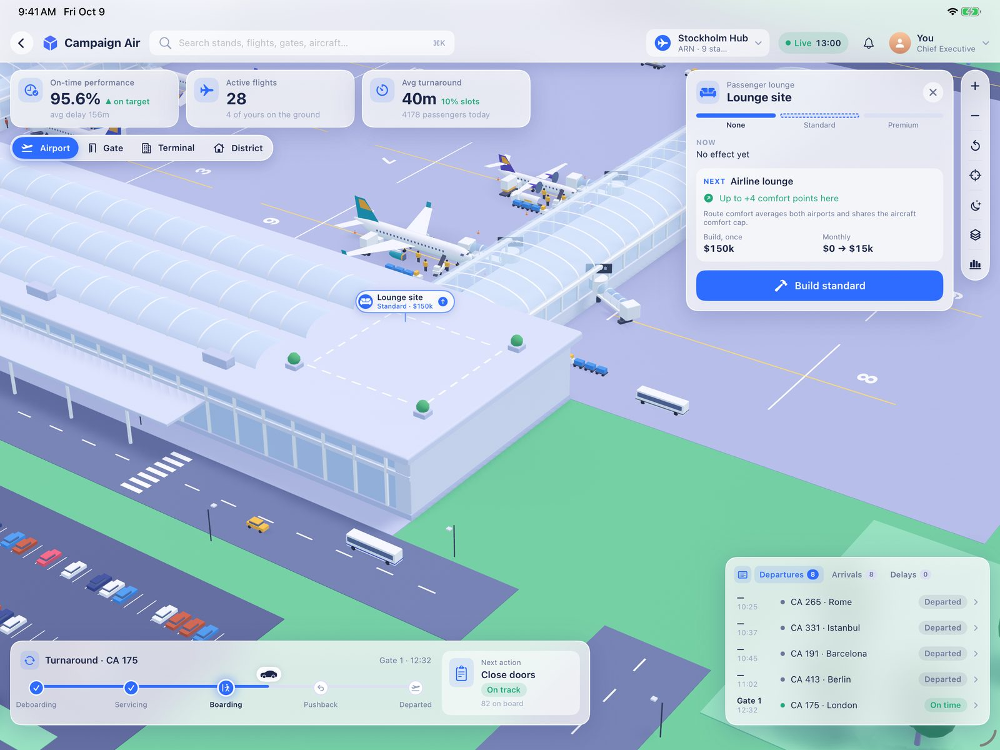 | 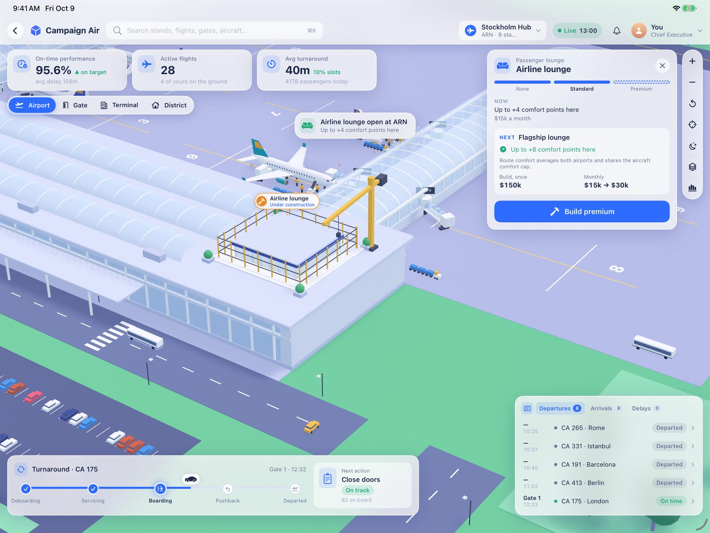 | 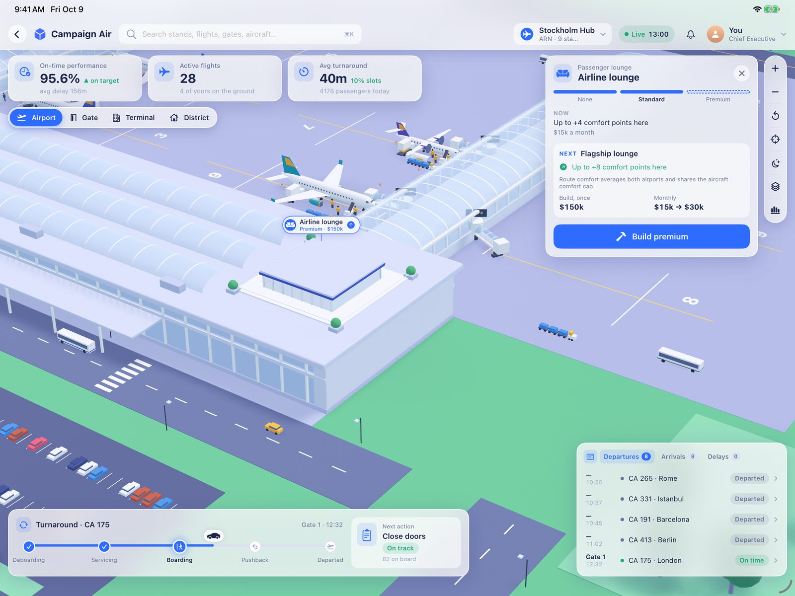 |
| | 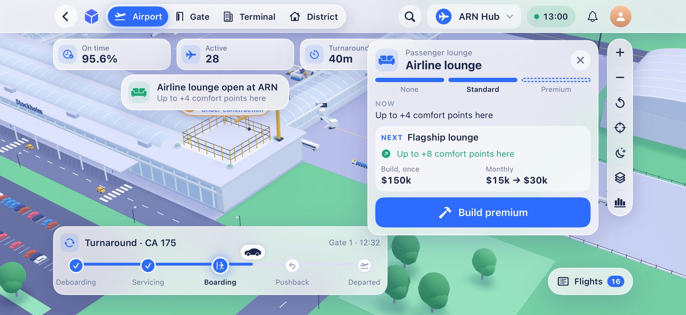 | 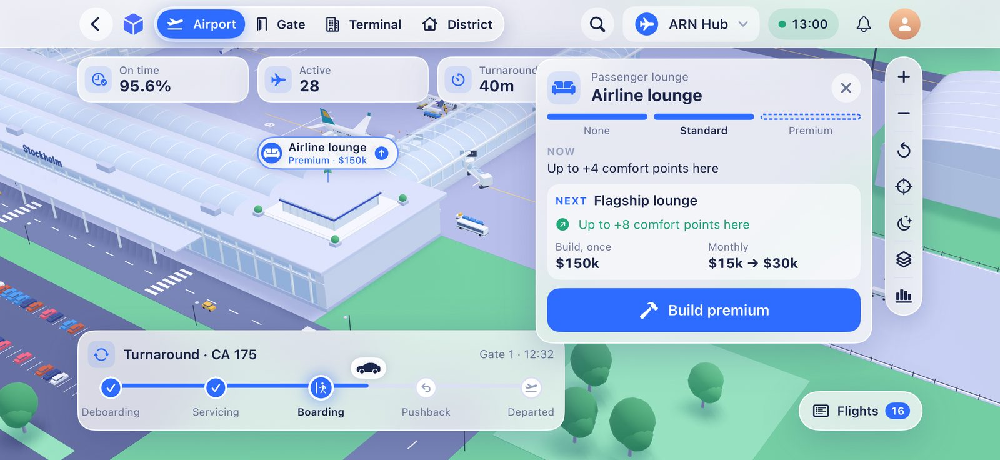 |

**Next (steps 2 and 3 of the plan):** new facility types — the full plan,
priorities and the owner's open decisions are in
[`HUB_PROGRESSION_PLAN.md`](HUB_PROGRESSION_PLAN.md). Authored models for each level go in as per-level slots
(`Hub_lounge_l1/l2`, `Hub_gseDepot_l0/l1/l2`), falling back to these
procedural buildings until they exist.

---

## 1. Where things stood after the first build

### What exists and works

| Area | Where | State |
|---|---|---|
| Layout (stands, piers, runways, roads, district, terminal interior) | `AirlineEmpireCore/.../Session/HubLayout.swift` | Deterministic from `AirportSpec` + `AirportFacilities`. Unit-tested on Linux. |
| Live read model (turnarounds, board, KPIs, occupancy) | `AirlineEmpireCore/.../Session/HubSnapshot.swift` | `GameState.hubSnapshot(...)`. Unit-tested. |
| Tests | `AirlineEmpireCore/Tests/AirlineEmpireCoreTests/HubViewTests.swift` | 16 tests, all green. |
| Renderer | `AirlineEmpireApp/Sources/Hub/` | RealityKit `ARView(.nonAR)`; procedural meshes batched per material; day/night repaint; heatmap; overlays; camera shots; gestures. |
| Authored-model seam | `HubAssetLibrary.swift`, `Resources/HubModels/` | Drop `Hub_<slot>.usdz` in and it replaces the procedural piece. **No models delivered yet.** |
| Dashboard chrome | `HubChrome.swift`, `HubScreen.swift`, `HubScreenModel.swift` | Top bar, KPI cards, shot picker, map controls, inspector, timeline, board, callout, pins, pills. Close to the reference. |
| Entry point | `MapSelectionCards.swift` → `GameController.openHub` → `RootView` full-screen cover | "View … hub in 3D" on the home/served airport card. **iOS 18+ only** (app floor stays iOS 17; the button is hidden on 17). Behind `AEFeature.hubView3D`. |
| Capture workflow | `.github/workflows/hub-view-review.yml` + `UITests/HubViewUITests.swift` | Renders all six shots on iPad Pro 13" and iPhone 17 Pro Max simulators on every PR that touches the hub. |
| Review loop | `scripts/hub-review/` | Fetch captures, cut reference frames, build side-by-side sheets (§4). |

### How it looks today (iPad, third session, `9d04f4b`)

`docs/design/hub-view/hub-0*.jpg` are the latest renders (the first
build's are in git history at `b5624e1`). The gap list below was written
against the first build; §0 says what is closed.

| Overview | Gate |
|---|---|
| 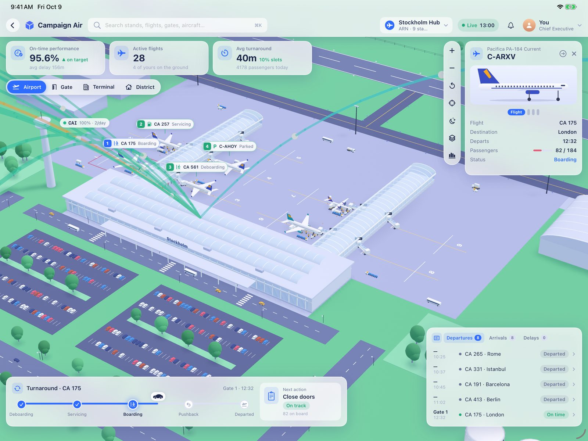 | 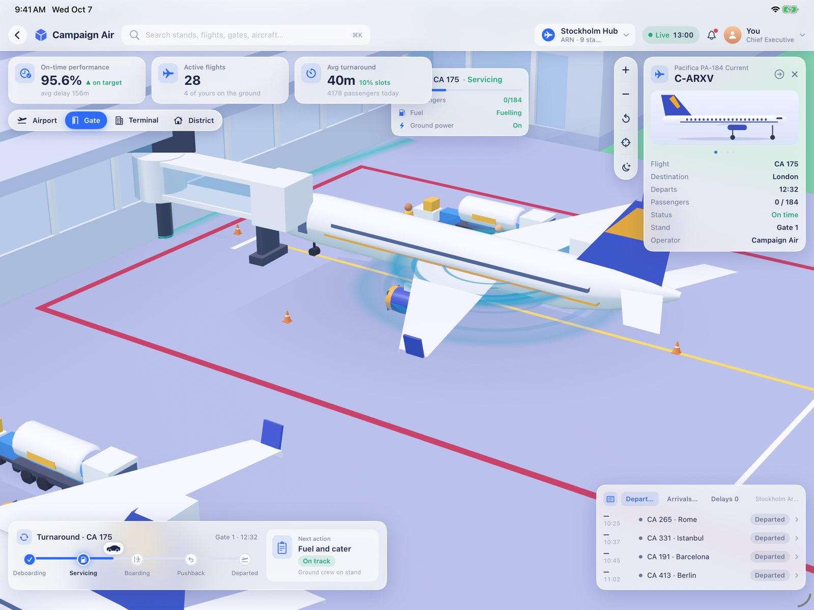 |
| **Terminal** | **District** |
| 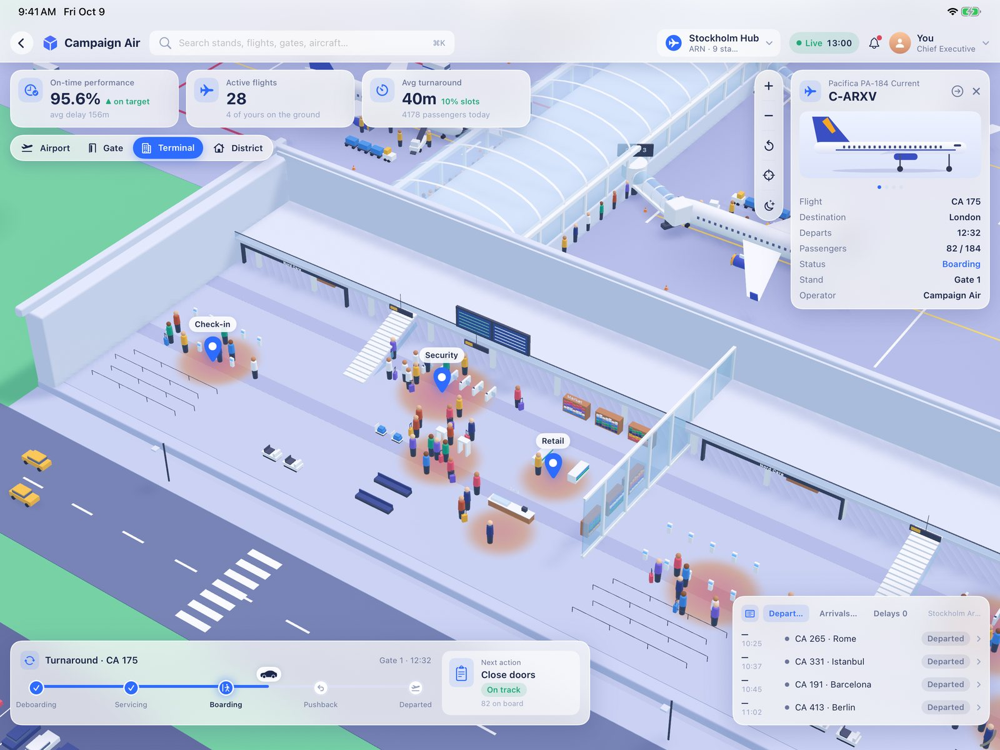 | 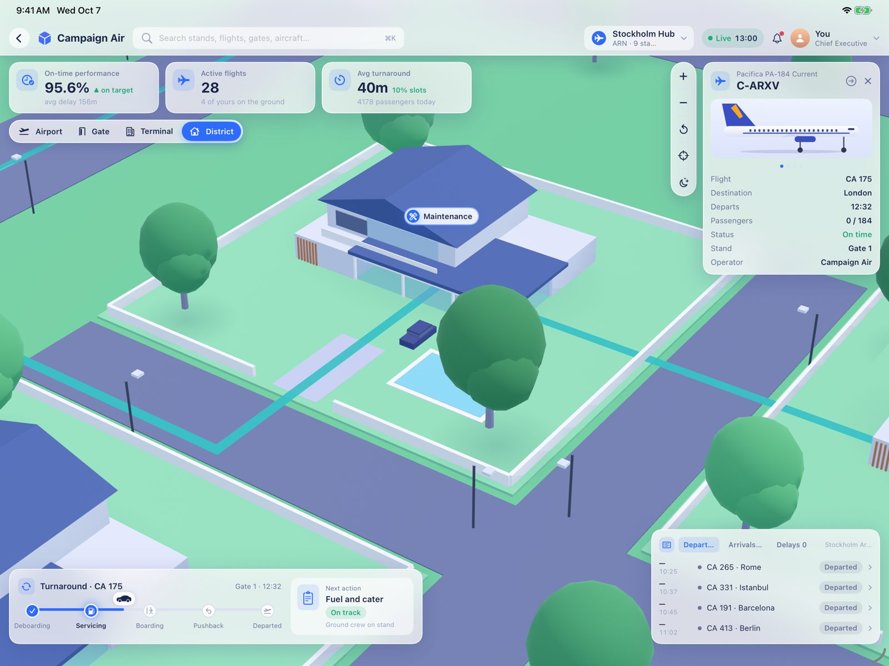 |
| **District, night** | **Overview, night** |
| 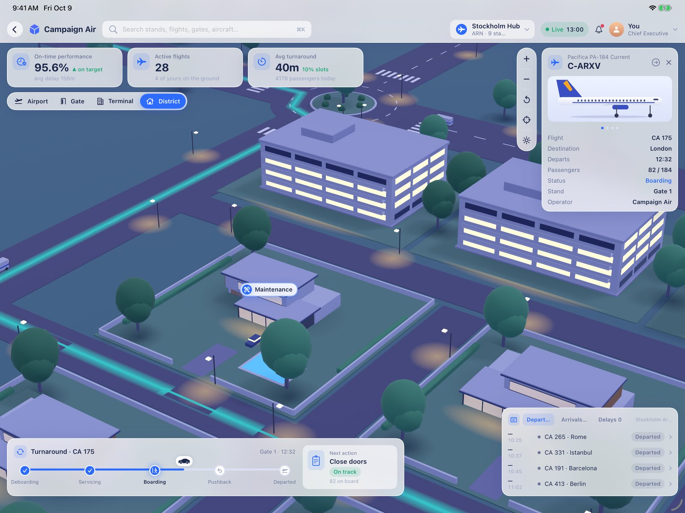 | 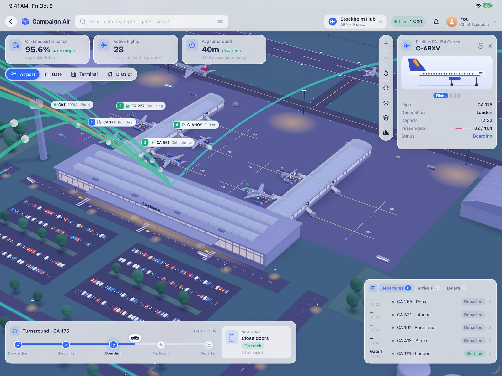 |

### Honest verdict

The **dashboard is about 85 % there**. The **3D world is about 40 % there**:
palette, materials, camera language and the overlay vocabulary match, but
composition, density and model detail do not. Side by side with the
reference, nobody would call it identical yet. The gaps below are specific
and fixable; none needs a new architecture.

---

## 2. Gap list — shot by shot

Measured against the reference's lower panel (540 × 304 px frames; positions
are fractions of frame width/height from the top-left). "Ref" = reference,
"Ours" = `b5624e1`.

### A. Overview (ref 0.5 s)

| # | Ref | Ours | Fix |
|---|---|---|---|
| A1 | Camera elevation ≈ 30°, **terminal at frame centre**, two glass piers radiating, landside roads with zebra crossings across the bottom third, hangars top-right. | Camera aimed at the middle of an empty apron; the terminal is a thin white bar at the top-left edge; no landside in frame. | `HubScene.rig(.overview)`: target the terminal centre (`layout.terminal.center`), not the apron centre, and push the target ~30 % of the apron depth towards landside so the roads enter the bottom of frame. Distance ≈ 1.6 × terminal length. |
| A2 | Apron is **tight** around the stands: ~10 % empty concrete. Jets are big — a narrowbody's wingspan ≈ 12 % of frame width. | Huge empty apron (> 50 % of frame); jets ≈ 5 % of frame width. | `HubLayout.build()` (around `apronNorth`/`apronHalf`): size the apron to the stand envelopes + one taxilane (≈ 1 wingspan), not to a fixed margin. Then re-run the Core tests (`parkedAircraftEnvelopesAreClear`, `everyStandSitsOnTheApron`). |
| A3 | Terminal is a **glass building**: barrel-vault glass roofs on the piers, glass curtain walls, white frame. | Opaque white boxes. | Short term: `HubSceneBuilder.pier()` / `terminal()` → glass vault (`HubMeshBatch.vault`) with white ribs every 6 m. Long term: `Hub_concourse_glass`, `Hub_terminal_pavilion` (model list §4). |
| A4 | ~25 vehicles visible (fuel trucks, buses, tugs with carts, vans) on service roads and at stands. | A handful, mostly hidden. | `HubDynamics.dress()` levels + `buildLandsideTraffic()`: every occupied stand gets ≥ 3 vehicles; add 6–10 apron vehicles moving along the service road. |
| A5 | Pedestrian queue lit cyan on the walkway in front of the terminal. | None in this shot. | Show the focused stand's queue glow in every shot, not just `.gate`. |

### B. Gate turnaround (ref 2.5 s)

| # | Ref | Ours | Fix |
|---|---|---|---|
| B1 | Camera elevation ≈ 25°, from the **door (left) side**, aircraft fills ≈ 55 % of frame width, nose to the right at x≈0.7. Glass concourse + "Gate 14" sign fill the top right. | Close, but the aircraft is seen from slightly above and behind; the bridge dominates the left; concourse barely visible. | `HubScene.rig(.gate)`: pitch 24° → 20°, distance `length × 2.5` → `× 2.1`, target the wing root, and swing the view so the concourse is behind the aircraft. |
| B2 | **Passenger queue**: ~20 people in a line along the walkway, cyan glow strip under them. | Not visible in the capture (stage is Servicing). | The capture fixture should land the focused stand on **Boarding** (add a test-only launch argument that forces `HubTurnaroundStage.boarding` on the focused stand); and the queue must be on screen in the gate framing. |
| B3 | **Pulse rings**: 3–4 glowing cyan/blue rings, stacked and tilted around the engine, very bright (additive). | One faint ring flat on the ground. | `HubDynamics.rebuildFocusOverlays()`: rings around the engine nacelle at engine height, tilted, emissive `pulse` with opacity falloff, staggered phase. Needs bloom (§3 step 5) to read like the ref. |
| B4 | **Jet bridge is glass** with white ribs and a rotunda; bridge cab meets the door. | Opaque white box tunnel with a dark leg. | `HubSceneBuilder.jetBridge()`: glass tunnel (`glass` material) with rib rings every 3 m; then `Hub_jetBridge` model. |
| B5 | Callout floats **over the aircraft** at x≈0.5–0.65, y≈0.35–0.55, fully visible. | Clipped behind the KPI cards at the top. | `HubScreen.anchored(.callout)`: clamp the projected point into the safe area between the KPI row and the timeline; anchor at the fuselage top above the wing, not at the nose. |
| B6 | Fuel truck (chrome tank), belt loader with yellow rails at the aft hold, tug at the nose, cones at the wingtips, crew in hi-vis. | Present but small and plain. | Models: `Hub_fuelTruck`, `Hub_beltLoader`, `Hub_tug`, `Hub_person_crew`. Meanwhile place them on the camera side of the aircraft so they read. |
| B7 | Aircraft: white, 4-pane windscreen, window row, indigo tail with orange flash, indigo nacelles, sharklets. | Close in livery; geometry is primitive (boxy wing, cylinder fuselage). | `Hub_aircraft_narrowbody` is the single highest-value model (model list §1). |

### C. Terminal cutaway (ref 5.5 s)

| # | Ref | Ours | Fix |
|---|---|---|---|
| C1 | **Doll's house**: back wall and one side wall stand, upper floor slab with windows, roof edge visible; front wall and roof removed. Camera ≈ 35°, looking into the corner. | Just a floor with props; no walls, no upper storey. Reads as an outdoor plaza. | `HubSceneBuilder.terminal()`: when the terminal shot is active keep back + side walls (`cutaway_back`, `cutaway_side`), a 5 m mezzanine slab along the back with a balustrade, and the roof edge as a frame. `HubScene.rig(.terminal)`: yaw so the back-left corner is the vanishing corner; pitch 47° → 35°; distance 125 → 95. |
| C2 | **FIDS** boards: two large dark screens on the mezzanine face, centre-top. | One small sign. | Two 6 × 2.5 m `screen` boards on the mezzanine front. |
| C3 | Shops with **fascia signs** ("Duty Free"), shelves **stocked** with small coloured boxes; café counter. | Coloured blocks for shelves; tiny labels. | `Hub_shop_pharmacy`, `Hub_shop_shelving`, `Hub_cafe_counter` models; until then add 3–4 rows of small product boxes per shelf. |
| C4 | Check-in kiosks with **blue lit screens**, e-gates, metal-detector arches, belt stanchions. | Present but sparse and small. | Double the kiosk count per bay; make kiosk screens emissive. Models in list §5. |
| C5 | **Heatmap**: several smaller, saturated pools (red core → orange → yellow → transparent), sitting where people cluster. | One huge washed-out pool. | `HubMaterials.heatImage`: radius 4–8 m, steeper falloff, alpha ≤ 0.85 at the core; one pool per hotspot, hotspots at kiosks / security / gates. |
| C6 | ~40 detailed people, luggage, electric carts. | Capsules. | `Hub_person_passenger_a…d` models; crowd count is already data-driven. |
| C7 | Two **blue map pins** above hotspots. | Present ("Security", "Retail"). | Fine; make them the ref's teardrop shape, larger. |

### D. District (ref 7.0 s)

| # | Ref | Ours | Fix |
|---|---|---|---|
| D1 | Camera ≈ 30°, further out: a villa at centre **plus** mid-rise apartments behind, more villas around, an aircraft crossing at the airside edge (top-right). | One villa fills the frame; nothing else. | `HubScene.rig(.district)`: distance 175 → 260, pitch 33° → 28°; `HubLayout.houses()`: put 2–3 `midrise` blocks on the airside side of the district so they land behind the villa. |
| D2 | **Route line** is a raised glowing tube (cyan → mint) on the road surface, with blue pins and white **pills** ("Maintenance", "Trash pickup", "Delivery") at stops. | Flat cyan stripes; one pill. | `HubDynamics.buildRouteLine()`: 0.6 m wide emissive ribbon 0.15 m above the road with rounded corners; pills for every service stop (Core already has `serviceStops`). |
| D3 | Roads curve (rounded corners, roundabout), zebra crossings at each junction, white kerbs. | Straight roads, square corners. | Fillet road corners in `HubLayout` (or in the builder: quarter-disc pieces at junctions). |
| D4 | Golf cart towing a tank trailer, a delivery truck, parked cars. | Cart and trailer exist but are off-frame. | Put the cart's loop through the framed stop. |
| D5 | Villa: two storeys, dark-framed glazing, wood cladding, flat roofs, walled garden with hedges and pool. | One-storey hip roof (a different house type). | `Hub_house_villa` model (list §7); procedural fallback should switch to flat roofs + big glazing. |

### E. Night (ref 8.5 s)

| # | Ref | Ours | Fix |
|---|---|---|---|
| E1 | Ground is a **luminous blue-grey indigo**, still readable; shadows are soft. | Saturated dark navy; flat. | `HubPalette.night`: desaturate towards `#5A5E8E` ground / `#4A4C78` road; raise IBL; keep the key light low and blue. |
| E2 | **Windows glow** warm (`#FFD9A0`) on every building — grids of lit windows, light spilling on lawns. | One lit strip on the villa. | Window prims on every building get the `windowLit` emissive at night; add a soft additive light-pool decal under lit façades. |
| E3 | Route line and path lights **glow** (bloom). | No bloom. | §3 step 5. |
| E4 | Trees are dark teal, not black; street lamps are bright points with a small halo. | Trees nearly black; lamp pools are flat ellipses. | Lift `night.tree` ≈ +20 % lightness; lamp heads emissive + bloom. |

### F. Dashboard (all shots)

| # | Ref | Ours | Fix |
|---|---|---|---|
| F1 | Inspector shows a **rendered 3D aircraft** (soft studio render) and is taller. | Flat profile drawing. | Render the hub's own aircraft entity offscreen once (RealityKit `ARView.snapshot` on a hidden view or a second `RealityView`) and show the image. |
| F2 | Timeline card is wider (≈ 60 % of screen) with a vehicle icon riding the line; next-action card beside it. | Present, narrower. | Widen on iPad (`HubChrome` timeline width = 0.58 × width). |
| F3 | No shot picker on screen (the ref changes shots by camera moves). | Shot picker chip row under the KPIs. | Keep — it is our UX — but it may hide when the inspector is open on iPhone. |

---

## 3. The work plan

Each step is one PR. Each ends with a `Hub view review` run and a comparison
sheet (§4) attached to the PR. Do them in this order — composition first,
because no model or shader fixes a wrong framing.

| Step | What | Files | Done when |
|---|---|---|---|
| **1. Composition** | A1, A2, B1, B5, C1 (camera + walls), D1. Tighter apron; new rigs; callout clamped; doll's-house walls. | `HubLayout.swift`, `HubScene.swift`, `HubSceneBuilder.swift`, `HubScreen.swift`, `HubViewTests.swift` | Each of the five comparison rows has the same **subject in the same place** at the same size (±10 % of frame), checked by laying a 3 × 3 grid over both halves. |
| **2. Density** | A4, A5, B2, B6 placement, C2, C4, C5, D2, D3, D4. More vehicles, queues, kiosks, FIDS, saturated heatmap, glowing route, curved roads, pills. | `HubDynamics.swift`, `HubSceneBuilder.swift`, `HubMaterials.swift`, `HubLayout.swift` | Counting objects in each comparison row gives within ±25 % of the reference (vehicles, people, kiosks, pins/pills). |
| **3. Glass and night** | A3, B4 procedural glass; E1, E2, E4 palette and windows. | `HubSceneBuilder.swift`, `HubPalette.swift`, `HubMaterials.swift` | Night row: ground/road/window colours within ΔE ≈ 10 of the reference's sampled values (sample with PIL on both halves). |
| **4. Authored models** | Pipeline: [`HUB_MODEL_PIPELINE.md`](HUB_MODEL_PIPELINE.md) (Meshy → Blender via MCP → `scripts/hub-models/` → checker). Model list §9 priority order: narrowbody → people → jet bridge/concourse/gate sign → turnaround vehicles → terminal hall + interior props → villa/trees/cart → the rest. Commission or build them (Blender) to the rules in model list §0; drop into `AirlineEmpireApp/Resources/HubModels/`. | No code (that is the point); tune `HubSceneBuilder.authored()` fits only if a model is off. | Each model, once dropped in, shows in all captures with correct scale, facing and repaint (day and night). |
| **5. Post-processing** | Bloom (cyan overlays, windows, lamps, pulse rings) and soft ambient occlusion — the "pre-rendered" softness of the reference. `ARView.renderCallbacks.postProcess` gives the colour **and depth** textures; write a Metal compute pass: threshold + Gaussian (`MPSImageGaussianBlur`) + add for bloom; a 8–12-tap SSAO on depth, half resolution, blurred, multiplied in. Gate it on device class (A15+). | new `HubPostProcess.swift` (+ `.metal`), `HubScene.swift` | Glows halo like the reference; corners darken softly; frame time stays inside budget (step 6). |
| **6. Device pass** | Instruments on a physical A15 iPhone and an M-series iPad: ≤ 16.7 ms frame at overview, ≤ 2 500 entities, ≤ 250 k triangles; pause rendering when hidden; thermal state ok after 5 min. | `HubScene.swift`, model LODs | Numbers recorded in `HUB_VIEW_3D.md` §10. |
| **7. Ship** | Turn on `AEFeature.hubView3D` for 1.1; add the hub to store screenshots if it earns it. | `HubScreen.swift` (`AEFeature`), release docs | Owner approves the comparison sheet. |

"Identical" in practice means: same composition, same palette, same object
set and density, same overlays and chrome, same mood at night — so that the
two halves of every comparison row read as the same product. Pixel-identical
is not the goal and not reachable in real time on a phone; the reference is
pre-rendered with global illumination.

---

## 4. How to check yourself (the review loop)

Do this after every visual change. Never call a visual change done without
looking at the comparison sheet.

```bash
# 0. Once per machine: get the reference clip from the owner (Isac).
#    It is NOT in the repo (public repo; someone else's work). Keep it in the
#    git-ignored .hub-review/ folder.
scripts/hub-review/extract-reference.sh .hub-review/reference.mp4
#    -> .hub-review/reference/REF-HUB-0{1..5}-*.png  (+ all/ at 4 fps)

# 1. Push. The "Hub view review" workflow renders the six shots (~25 min).

# 2. Fetch the frames of that commit (iPad frames come out upright).
scripts/hub-review/fetch-captures.sh "$(git rev-parse HEAD)"
#    -> .hub-review/captures/{ipad,iphone}/KEY-HUB-*.png

# 3. Side-by-side sheets.
python3 -I scripts/hub-review/compare.py
#    -> .hub-review/compare.jpg and compare_<shot>.jpg — open and LOOK at them.
```

The capture test is `AirlineEmpireApp/UITests/HubViewUITests.swift`; launch
arguments `-AEUITestOpenHub`, `-AEUITestHubShot <shot>`, `-AEUITestHubNight`
open the hub straight into a shot. The campaign fixture comes from
`ae-rival-probe` in the workflow (Stockholm-Arlanda hub).

Also check the **iPhone** frames: portrait framing is computed from the
aspect in `HubScene.rig(..., aspect:)` and breaks differently.

---

## 5. Build, test, CI

| What | Command / where |
|---|---|
| Core build + tests (Linux ok) | `cd AirlineEmpireCore && swift build && swift test --filter HubViewTests` (full `swift test` before pushing). |
| Warnings are errors in CI | `swift build -c release -Xswiftc -warnings-as-errors` |
| Linux toolchain | `scripts/setup-linux-toolchain.sh` |
| App | XcodeGen: `cd AirlineEmpireApp && xcodegen generate`; never commit the `.xcodeproj`. App code only compiles on macOS — CI's `iOS app (xcodebuild) · compile` is the check from Linux. |
| Workflows that matter | `CI`, `Launch safety` (app job ≈ 40 min, timeout 55), `Hub view review`, `Map camera review`, `Release portability`. |
| GitHub from the cloud | `gh` REST works (`gh api ...`); GraphQL may be blocked. |

---

## 6. Rules and traps

- **Platform split.** The app's floor is iOS 17. Everything in `Sources/Hub/`
  is `@available(iOS 18.0, *)`; every entry point is behind
  `if #available(iOS 18.0, *)`. Don't raise the app's deployment target.
- **Data, not decoration.** Every stand, vehicle, person count and heatmap
  pool comes from `HubLayout`/`HubSnapshot`. Add density by deriving it from
  simulation numbers (`HUB_VIEW_3D.md` §6), not by scattering props.
- **Layout lives in Core** and is deterministic and tested. If you move
  things in `HubLayout`, keep `HubViewTests` green and add a test for the new
  rule.
- **Materials by key.** Geometry is batched per `HubMaterialKey`; night mode
  repaints keys. New look = new key in `HubMaterials`, both palettes in
  `HubPalette`.
- **Authored models** must follow model list §0 (metres, +Y up, +X forward,
  pivot at base centre, `ae_<slot>` prim names). Missing files fall back to
  procedural — never crash on a missing model.
- **Don't copy the reference's identity**: no "WareTrack", "AirOps Digital
  Twin", "BodyTree", their logos or avatar; no real airline liveries or
  registrations. Match style, proportions, colours and density only.
- **Never commit the reference clip or frames cut from it** (public repo).
  `.hub-review/` is git-ignored for that reason.
- **Edit Swift with targeted edits.** A scripted search-and-replace once
  wiped `HubScene.swift` to garbage (an empty match slice); if you script
  edits, assert the match is non-empty and re-read the file.
- `app.screenshot()` crops a landscape iPad; the tests use
  `XCUIScreen.main.screenshot()` and the frames need rotating (the fetch
  script does it).
- Performance budget (`HUB_VIEW_3D.md` §7): ≤ 2 500 entities, ≤ 250 k
  triangles at the overview, 60 fps on A15. Batch meshes; clone resources.

---

## 7. Open questions for the owner

1. ~~Who makes the models~~ — decided 2026-10-09: Meshy + Blender via
   Claude ([`HUB_MODEL_PIPELINE.md`](HUB_MODEL_PIPELINE.md)). Needs the
   owner's Meshy API key and Blender set up on his PC.
2. Is the shot picker (our UX) fine, or should shots change only by camera
   moves as in the reference?
3. Should the hub go in the 1.1 store screenshots?
